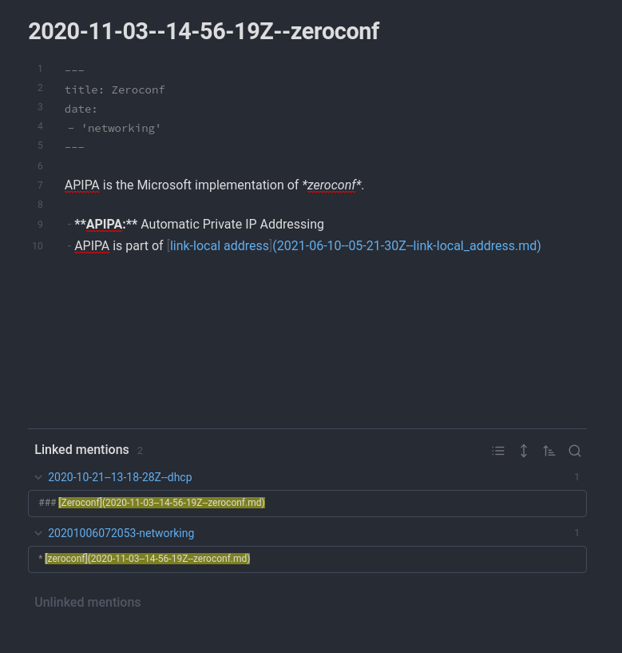

Photo by [Jan Kahánek](https://unsplash.com/@honza_kahanek?utm_content=creditCopyText&utm_medium=referral&utm_source=unsplash) on [Unsplash](https://unsplash.com/photos/shallow-focus-photography-of-pencil-on-book-g3O5ZtRk2E4?utm_content=creditCopyText&utm_medium=referral&utm_source=unsplash)
  
I'm a religious note-taker. Back in my school days, I kept lots of notebooks and
I had a habit of always carrying around a Moleskine and jotting down ideas,
writing notes, or journaling. Now many years later I've developed a habit of
writing my notes in digital form. Mostly this was so that I could make them
searchable. At first, my notes started out as a few text files but eventually, I
started writing all of my notes in
[Markdown](https://daringfireball.net/projects/markdown/). They're still text
files, but Markdown is an easy-to-read and easy-to-write markup that renders
nicely to HTML.

Here's an example from my notes:

```markdown
---
title: OSI Model
date: 2020-10-06 07:42
---

**OSI:** Open Systems Interconnection

1. [Layer 7 - Application](2020-10-11--16-57-07Z--layer_7.md)
2. [Layer 6 - Presentation](2020-10-11--16-52-39Z--layer_6.md)
3. [Layer 5 - Session](2020-10-11--16-46-48Z--layer_5.md)
4. [Layer 4 - Transport](2020-10-10--18-46-30Z--layer_4.md)
5. [Layer 3 - Network](2020-10-10--18-44-39Z--layer_3.md)
6. [Layer 2 - Data Link](2020-10-10--18-43-20Z--layer_2.md)
7. [Layer 1 - Physical](2020-10-10--18-41-00Z--layer_1.md)

Mnemonic:
_All People Seem To Need Data Processing._

## References

* https://www.freecodecamp.org/news/osi-model-networking-layers-explained-in-plain-english/
* [Wikipedia - OSI model](https://en.wikipedia.org/wiki/OSI_model)
```

## Zettlekasten and Obsidian

At some point, I stumbled across how to maintain your own personal knowledge
base as a [Zettelkasten](https://zettelkasten.de/introduction/). I call mine my
"second brain". I've experimented with maintaining a personal wiki in Vim with
things like [vimwiki](https://github.com/vimwiki/vimwiki) and
[wiki.vim](https://github.com/lervag/wiki.vim), and even learned Emacs so that
I could try to organize my life with [org-mode](https://orgmode.org/).

If you're interested in the Zettlekasten idea I recommend checking out:

* [Zettlekasten - Getting Started](https://zettelkasten.de/posts/overview/)
* [How to Take Smart Notes](https://www.soenkeahrens.de/en/takesmartnotes) by Sönke Ahrens

### Text editing

These days I use [Obsidian](https://obsidian.md/) to take notes and maintain my
personal knowledge base. After spending countless hours
[shaving yaks](https://en.wiktionary.org/wiki/yak_shaving) with my Emacs or
[Vim configs](https://github.com/kraker/dotfiles/tree/master/nvim/.config/nvim)
I've realized that the text editor you use to write and maintain your notes
isn't that important. It's the activity of taking notes that is. Obsidian gives
me most of what I need out of the box and I'm less likely to get distracted with
tweaking vim configs. Obsidian has a
[vim-mode](https://publish.obsidian.md/hub/04+-+Guides%2C+Workflows%2C+%26+Courses/for+Vim+users) 
so that I can still use modal editing which is a requirement for me with any
text editor. I think many Linux Sysadmins are similar in this regard. Obsidian
also has a "mind-map" feature that I think is pretty neat but I don't use it
that often unless I'm showing others how neat I think it is.
Ultimately what text editor is used to maintain your knowledge base
isn't that important. It's more important that it makes taking notes relatively
painless and doesn't get in the way too much.

## Writing notes in Markdown

Since all of my notes are just a collection of 
[Markdown](https://daringfireball.net/projects/markdown/syntax) files I can
easily port them to any text editor or knowledge-base tool that supports that.
This website is a [Hugo](https://gohugo.io/) static site and I write all of my
blog posts in Markdown. This is much easier than writing HTML and Hugo just
renders the `.md` files into HTML for me in milliseconds when I build the site.

```bash
alexkraker.com on  dev [!?] 
i❯ hugo
Start building sites … 
hugo v0.116.1-3e1ea030a5897addaf9d113d0826709fe07f77c0+extended linux/amd64 BuildDate=2023-08-01T07:24:54Z VendorInfo=gohugoio


                   | EN  
-------------------+-----
  Pages            | 18  
  Paginator pages  |  0  
  Non-page files   |  3  
  Static files     |  4  
  Processed images |  0  
  Aliases          |  1  
  Sitemaps         |  1  
  Cleaned          |  0  

Total in 83 ms
```

This also made publishing all of my notes online relatively easy... more on that
later.

If you spend a lot of your time in the digital world like me I highly recommend
learning Markdown and taking notes in this markup. Many platforms that are used
in the digital world usually have some sort of Markdown support too. Jira, Zendesk,
Google Chat, Slack, Discord... just to name a few that I've discovered support
writing in Markdown syntax. I write Markdown everywhere I can now without really
thinking about it.

If you're interested in learning Markdown I recommend:

* [Markdown Guide - Getting Started](https://www.markdownguide.org/getting-started/)
* Daring Fireball's [Markdown: Syntax](https://daringfireball.net/projects/markdown/syntax) 
  is the original spec.

## Version controlled backups

Since my notes are all just text files I back them up to a [Git](https://git-scm.com/)
repository in the cloud. Using Git also has the added benefit of version control
for my notes and I can easily manage sharing my notes between multiple devices
by cloning the repository to that device and using `git pull` and `git push` to
sync my notes. [My notes repository](https://github.com/kraker/second-brain) is
hosted on GitHub and I've made it public so that I can easily share them with
others if I want to.

There's a community [Git plugin](https://publish.obsidian.md/git-doc/Start+here)
for Obsidian that syncs my notes to my repository at regular intervals so I don't
even have to think about it.

## Owning my data and portability

Because my notes are just simple text files I don't have to worry about them
being stored in some type of proprietary data format. My notes are portable and
can be edited anywhere I have a basic text editor. I also own my notes data.
Long-term I don't run the risk of losing them if they're stuck in a proprietary
platform like [Roam Research](https://roamresearch.com/), for example. On long
enough time scales most proprietary tools and data formats may not exist, just 
look at the [Killed by Google](https://killedbygoogle.com/) for lots of examples. 
I'd hate to lose the countless hours I've spent on my "second brain". In other
words, it's important to me that my notes are 
[future-proof](https://en.wikipedia.org/wiki/Future-proof).

## Structuring my personal knowledgebase

Before I learned about Zettelkasten I tried to organize my notes into folder
structures and hierarchies. But after a while this becomes difficult to
maintain and thinking and making decisions about the "taxonomy" of your
knowledge base can become a barrier to actually writing notes. Nowadays my notes
are all just a single folder. With a Zettelkasten you create links between
notes. This is a bit like [hyperlinking](https://en.wikipedia.org/wiki/Hyperlink).
This is more like how your brain works. The linking is what gives structure to
your knowledge base and this develops organically over time as you tend to your
digital garden.

After a while, some of your notes start to accumulate back-links from other
notes that are related to it. In Obsidian these are called "linked mentions" at
the bottom of the note.



### Atomic notes

I try to keep my notes
[atomic](https://medium.com/branching-thought/anatomy-of-an-atomic-note-zettel-fe329a427a7a)
and contained to one idea or concept.

Here's an example from one of my notes on networking about IPv4:

```markdown
---
title: IPv4
date: 2020-10-21 12:40:14
tags:
- 'networking'
---

**Internet Protocol version 4 (IPv4)** is the fourth version of the 
[Internet Protocol](2020-10-10--17-59-03Z--internet_protocol.md) (IP). It is one
of the core protocols of standards-based internetworking methods in the
[Internet](2020-10-11--17-17-39Z--internet_layer.md) and other packet-switched
networks. IPv4 was the first version deplyed for production on SATNET in 1982
and on the ARPANET in January 1983. It is still used to route most Internet
traffic today, despite the ongoing deployment of a successor protocol, 
[IPv6](2020-10-21--12-40-26Z--ipv6.md).

IPv4 uses a 32-bit address space which provides 4,294,967,296 (232) unique
addresses, but large blocks are reserved for special networking methods. 

Source: https://en.wikipedia.org/wiki/IPv4

* Uses dotted-octet numbering system *(i.e. 192.168.0.1)*
  + 4 8-bit numbers 0-255, separated by '.', total of 32 bits.
  + 192.168.0.1 = 11000000.10101000.00000000.00000001

## Commands

* Windows: `ipconfig /all`
* MacOS: `ifconfig`
* Linux: `ifconfig` or `ip a`
```

### Hub notes

Sometimes I'll create a note that's a hub with links to lots of other notes about
a particular topic. A good example from my Zettlekasten is my hub note from when
I was learning Python.

```markdown
---
title: Python Notes
date: 2021-09-10 05:56
tags:
- 'python'
- 'dev'
---

# Python Notes

## Basics

* [Math Operators](20210910055642-math-operators.md)
* [Common Data Types](20210910201237-data-types.md)
* [String Concatenation and Replication](20210910201646-string-concatenation-and-replication.md)
* [Variables](20210910202050-variables.md)
* [Common Functions](20210910204323-common-functions.md)
* [Text and Number Equivalence](20210910210013-text-and-number-equivalence.md)

## Flow Control

* [Boolean Values](20210910210804-boolean-values.md)
* [Comparison Operators](20210910210949-comparison-operators.md)
* [Boolean Operators](20210910212715-boolean-operators.md)

### Elements of Flow Control

* [Conditions](20210911072918-conditions.md)
* [Code Blocks](20210911074141-code-blocks.md)
* [Program Execution](20210911074451-program-execution.md)

### Flow Control Statements

...
```

_This is just the first 20 or so lines of that hub note, if you're interested
in seeing the whole thing, here's a link to my
[Python Notes](https://github.com/kraker/second-brain/blob/main/20210910055625-python-notes.md?plain=1)._

### Other types of notes

There are other types of notes that you can take in your Zettelkasten and some of
them are helpful for doing research. An example is "fleeting notes" which are
something you jot down to capture a fleeting thought or idea that you will flesh
out and categorize later.

If you're interested in learning about the various other types of notes and
how to use a Zettelkasten these ways
[From Fleeting Notes to Project Notes](https://zettelkasten.de/posts/concepts-sohnke-ahrens-explained/)
is worth a read.

Personally, I try to keep things simple and just focus on atomic notes and hub
notes when those become unwieldy. Maybe if I decide to write a book someday I'll
get more into using my Zettelkasten these ways to accumulate research. It's
important to not get too caught up in methodology at first I feel. Developing
the basic habit is more important.

## From notes to "digital garden"


Photo by [Filip Urban](https://unsplash.com/@yngprmtv?utm_content=creditCopyText&utm_medium=referral&utm_source=unsplash) on [Unsplash](https://unsplash.com/photos/boy-in-black-and-white-long-sleeve-shirt-standing-beside-gray-metal-watering-can-during-daytime-ffJ8Qa0VQU0?utm_content=creditCopyText&utm_medium=referral&utm_source=unsplash)
  
A friend of mine that I used to work with published his technical notes
about some tools we all used on his website. This inspired me to publish my own
notes on a website so that I could share them with others. Some people like to
call this online repository of their thinking, research, or notes their
[digital garden](https://maggieappleton.com/garden-history). I like this concept
because tending to your notes is a bit like gardening. I've spent countless
hours tending mine.

Here's a link to my digital garden if you're curious:
[Alex's Second Brain](https://notes.kraker.dev/)

Sometimes if somebody asks how I learned something or asks for advice I'll often
link them one of my notes if I have one on that topic.

At first, publishing my notes online was a manual process, but I've since
automated it so that all I need to do is write the notes and automation takes
care of the rest. How I did this is probably a good topic for a future article,
so stay tuned!
